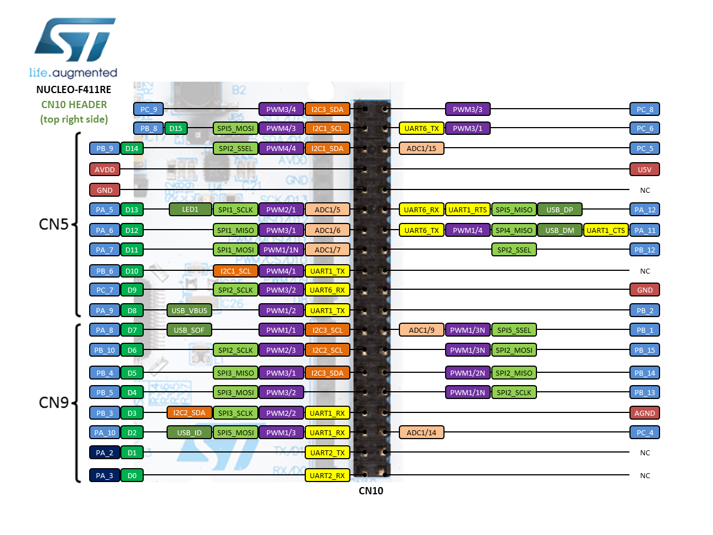

# Cinematographic Rover
Currently in development phase ...    
Tracks object pose according to the pilot specification to generate a cinematographic shot for broadcast rovers and buggies. 

## Getting Started
___
This is a detailed guide on how to set up buggy , MCU , Onboard comp and Gimbal configurations.

These instructions will get you a copy of the project up and running on your local machine for development and testing purposes. See deployment for notes on how to deploy the project on a live system.


## Prerequisites
___
The project is being built on the following hardware and software. 

### Hardware and Components
---
**MCU** - [STM32 F411RE](https://www.st.com/en/microcontrollers-microprocessors/stm32f411re.html)

**ONBOARD COMPUTER** -      
CPU - Intel Core i5-8250U @ 8x 3.4GHz   
GPU - Mesa Intel(R) UHD Graphics 620 (KBL GT2)        
KERNEL - x86_64 Linux 5.6.15-1-MANJARO

( Will be later implemented on [NVIDIA JETSON](https://www.nvidia.com/en-us/autonomous-machines/embedded-systems/jetson-nano/))

**GIMBAL** - [ALEXMOS 3 AXIS GIMBAL](https://www.aliexpress.com/item/32845757144.html?spm=a2g0s.9042311.0.0.69d04c4dwliz99)

**CAMERA** - Webcam (prototype).      
( Later to be implemented on GoPro Variant )

**BUGGY** - Simple RC Car ( Prototype )     
( Will be later implmented on [MEDIUM SCALE BUGGY](https://youtu.be/9xU-PAi53EI) )

### Software Setup
---
Install PlatformIO VSCODE
You may get the error while uploading.
```
Error: libusb_open() failed with LIBUSB_ERROR_ACCESS
```  
[See here for the solution]()
Python Libs - Non exhaustive list ( will be making a bash script to test avail libs make )    
OpenCV 4.3.0 At least.     


## Installing
---
A step by step series of examples that tell you how to get a development env running

**MCU Connections**   

      
[Refence / More Details](https://electronics.stackexchange.com/questions/167414/how-to-reconnect-nucleo-to-st-link-part)      
       
**Periferals**

UART Gimbal TX ( PA 12 )      
UART Gimbal RX ( PA 11 )      

UART OBCOMP TX ( PA 3 )     
UART OBCOMP RX ( PA 2 )     

UART STLINK/DEBUG TX ( Not yet assigned )     
UART STLINK/DEBUG RX ( Not yet assigned )     

    

**Onboard Computer Connections**

Simple USB to TTL Adapter ( as of now ).

**Gmbal Installation**

Gimbal inversion using [Olliw's GUI ](http://www.olliw.eu/2013/storm32bgc/) ( Ver 0.96).      
[MAVLINK setup and usage](http://www.olliw.eu/storm32bgc-wiki/MAVLink_Communication).

**Camera Installation** 

Plug and play USB as of now.

**Buggy installation**

Nil as of now.

**Onboard Computer and GUI installation**

Nil as of now.


```
Give the example
```

And repeat

```
until finished
```

End with an example of getting some data out of the system or using it for a little demo

## Running the tests

Explain how to run the automated tests for this system

### Break down into end to end tests

Explain what these tests test and why

### Testing vision algos Obcomp
___
In the main.py file in /vision
Make the following changes and run the program.
```
INCLUDE_STM = False
```     
Doing this will run the default vision algo code on your default webcam. If fails to open Camera put 1,2,3 ... 
```
VID_SRC = 0
```
### Testing Gimbal
---
Simply power it on it should be inverted and work something like this ( wait a few 15-30 secs for it to self calibrate. )

### Testing MCU 
---
Make sure all periferals are Connected.      
LEDS will blink thrice 2 times.     
The first set indicates it has Started setup and second state is being used for debugging purpose.

### Testing Comms betn Obcomp and MCU 
---
Nav to vision     
Run ComArduino2.py (setup appropriate ports).        


### And coding style tests

Explain what these tests test and why

```
Give an example
```

## Deployment

Add additional notes about how to deploy this on a live system

### Testing OBCOMP and MCU
---
Make sure you do this and appropriately setup UART port of obcomp in ComArduino2.py
```
INCLUDE_STM = True
```
Run the main.py python file.
After the setup ends of the MCU it will send an ACK command to the OBCOMP. 
Till then it will wait for MCU setup to complete.

### Testing Gimbal and MCU 
---
Once individual testing is done.    
Gimbal should move or nod itself in all dirs.
Hit reset again just to be sure. 

### Testing Buggy and MCU 
---
yet to be implemented.


## Built With

* [Dropwizard](http://www.dropwizard.io/1.0.2/docs/) - The web framework used
* [Maven](https://maven.apache.org/) - Dependency Management
* [ROME](https://rometools.github.io/rome/) - Used to generate RSS Feeds

## Contributing

Please read [CONTRIBUTING.md](https://gist.github.com/PurpleBooth/b24679402957c63ec426) for details on our code of conduct, and the process for submitting pull requests to us.

## Versioning

We use [SemVer](http://semver.org/) for versioning. For the versions available, see the [tags on this repository](https://github.com/your/project/tags). 

## Authors

* **Billie Thompson** - *Initial work* - 

See also the list of [contributors](https://github.com/your/project/contributors) who participated in this project.

## License

This project is licensed under the MIT License - see the [LICENSE.md](LICENSE.md) file for details

## Acknowledgments

* Hat tip to anyone whose code was used
* For this readme Template [PurpleBooth](https://github.com/PurpleBooth)
* Inspiration
* etc

